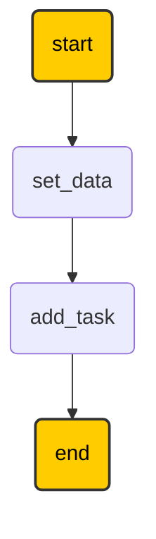
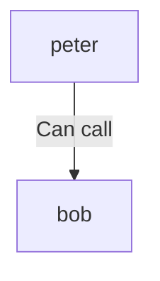
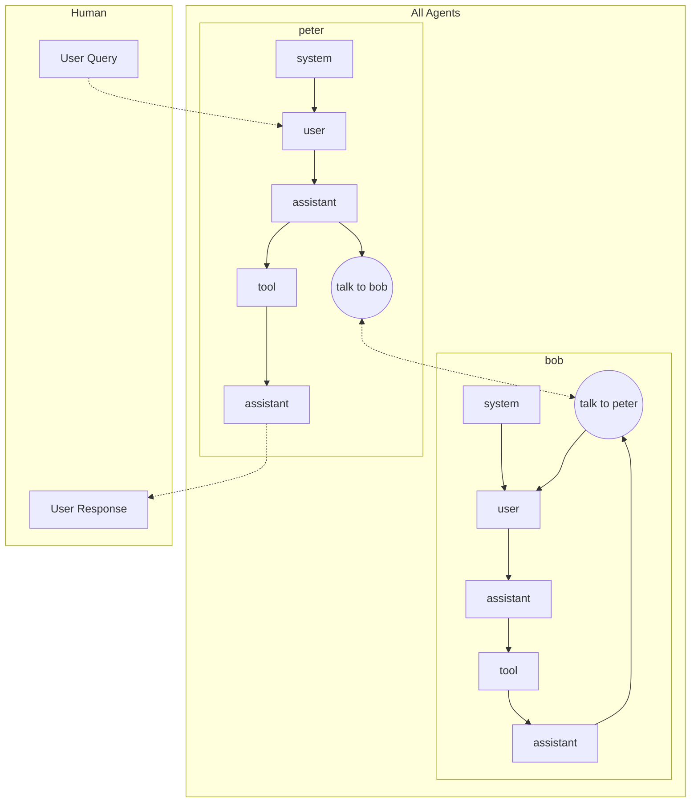

# LMFlux

<div style="display:flex; align-items:center; gap:20px;">
  
  <div>
    LMFlux is an open‑source library that helps create agentic workflows.
    It supports both declarative and imperative approaches for defining LLM‑based workflows.
  </div>
</div>

## Features
- Declarative workflow definition  
- Imperative step‑by‑step control  
- Built‑in support for any OpenAI‑compatible endpoint  

## Quick Start

Want to get started quickly?  
Install LMFlux:

```bash
pip install lmflux
```

## Simple Python Example

```python
from lmflux import openai_agent, tool, Session, Message

# Declare your tools
@tool
def add(a: int, b: int) -> int:
    """Add two numbers."""
    return {"result": a + b}

# Create a new agent from your OAI environment variables
agent = openai_agent(
    name="my‑agent",
    model="openai.gpt_oss_20b",
    tools=[add],
    system_prompt="You are a helpful assistant. Use tools when available."
)

# Send a message to your agent 
session = Session()
msg = Message("user", "What is 965 + 33264?")
resp = agent.conversate(msg, session)
print(resp.content)   # → 34229
```

## Running in a Jupyter Notebook

Below are two notebook‑friendly snippets for getting started with "agentic workflows" (Read supported architectures [here](getting_started/graph_types/))  
The markdown cells (preceding each code block) explain what is happening.

### 1. Pre‑defined LLM tasks

```python
# Jupyter cell: imports
from lmflux.graphs import TaskGraph, transformer_task, agentic_task
from lmflux import Session, Agent, Message, openai_agent, tool
```

```python
# Jupyter cell: define a tool used by the agent
@tool
def add(a: int, b: int) -> int:
    return {"result": a + b}
```

```python
# Jupyter cell: create the agent
agent = openai_agent(
    name="my‑agent",
    model="openai.gpt_oss_20b",
    tools=[add],
    system_prompt="You are a helpful assistant."
)
```

```python
# Jupyter cell: define tasks
@transformer_task
def set_data(session: Session):
    session.set("a", 985)
    session.set("b", 1265)

@agentic_task(agent)               # `agent` created earlier
def add_task(agent: Agent, session: Session):
    a, b = session.get("a"), session.get("b")
    msg = Message("user", f"What is {a}+{b}?")
    resp = agent.conversate(msg, session)
    session.set("result", resp.content)
```

```python
# Jupyter cell: build and run the graph, then inspect the result
G = TaskGraph()
G.connect_tasks(set_data, add_task)
G.show_mermaid()      # visualises the graph
result_session = G.run()
print(result_session.context["result"])   # → 2250
```


> **Tip:** Use `%%capture` at the top of a cell if you want to hide verbose output while still running the code.

### 2. Agent‑to‑Agent (Mesh) communication

```python
from lmflux import openai_agent, tool, Session, Agent, Message
from lmflux.graphs import MeshGraph

# Mock employee database (for demo purposes)
mock_employee = {
    "123456789": {"name": "Caio", "status": "ACTIVE", "department": "Engineering"},
    "987654321": {"name": "Frederico", "status": "INACTIVE", "department": "Sales"},
    "111111111": {"name": "Joao", "status": "ACTIVE", "department": "Accounting"},
}
@tool
def get_information(employee_id: str):
    """Retrieve employee info from a mock HR DB."""
    return mock_employee.get(employee_id, {"error": "Employee not found!"})

# Create two agents
peter = openai_agent(
    "peter",
    "openai.gpt_oss_20b",
    tools=[],
    system_prompt="You are Peter, an AI agent that talks to other agents."
)
bob = openai_agent(
    "bob",
    "openai.gpt_oss_20b",
    tools=[get_information],
    system_prompt="You are Bob, an AI agent with access to employee records."
)

# Connect them in a MeshGraph
G = MeshGraph()
G.connect_agents(peter, bob, "Ask Bob about employees")
G.show_mermaid()          # visual graph
```



```python
# Run the interaction (in a notebook you can display the mermaid directly)
G.set_mermaid_render()
G.show_result()
```

```
Message(assistant):
    
```

```python
# Run the interaction (in a notebook you can display the mermaid directly)
message = G.query_agent(peter, "What is the status of employee id 123456789?", show_progress=True)

# Message(assistant):
#	content: Employee **123456789** (Caio) is **ACTIVE** and currently works in the **Engineering** department.

G.set_mermaid_render()
G.show_result()
```
The result cell will display something like:



## Want more examples?
Check the  [Getting Started](/getting_started). page for additional use‑cases, deeper API explanations.