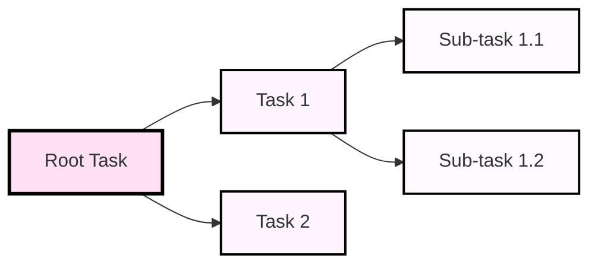
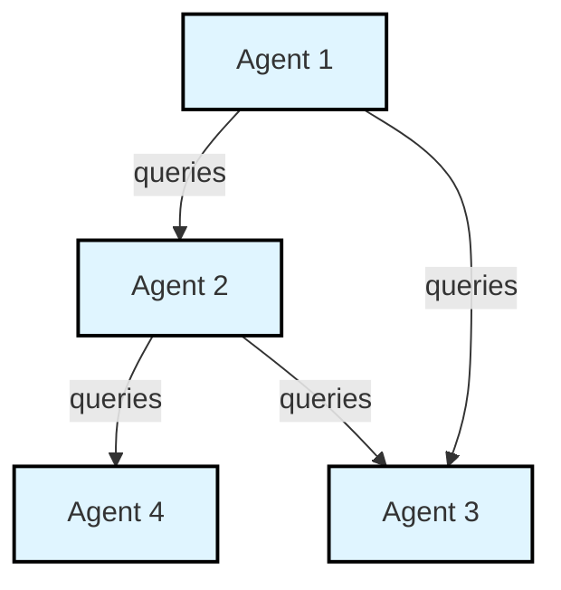

# Multi-Agent Architectures

**Supported architectures:** 

| Architecture | Description |
|--------------|-------------|
| **Task Graphs** | Linear‑plus‑branch workflow model for deterministic, step‑wise pipelines. |
| **Agent Mesh**  | Flexible, dynamic network of autonomous agents that collaborate, negotiate, and adapt in real time. |

## Task Graphs

Task Graphs model linear workflows that may branch into tree‑like sub‑tasks.  
They are ideal when each step depends on the result of the previous one while still allowing parallel branches.

### How Task Graphs Work

1. **Linear Execution** – Tasks run in a predetermined order.  
2. **Branching Structure** – A task can spawn multiple downstream sub‑tasks, creating a tree‑like hierarchy.  
3. **Dependency Management** – A downstream task starts only after its predecessor completes (or produces the required output).

### Practical Use Cases for Task Graphs

| Use Case               | Description                                                                                     |
|------------------------|-------------------------------------------------------------------------------------------------|
| Data Processing Pipeline | Sequential stages transform raw input into cleaned, enriched, and final output data.          |
| Automated Testing      | Run unit tests → integration tests → UI tests in a controlled sequence.                        |
| CI/CD Pipelines        | Automate build → test → package → deploy steps with optional parallel stages (e.g., linting).  |

### Task Graph Structure

*The `flowchart LR` direction (left‑to‑right) gives a cleaner, more modern look compared to the older top‑down layout.*

## Agent Mesh

Agent Mesh systems orchestrate multiple agents that interact through dynamic relationships.  
They excel in scenarios where autonomous components must collaborate, share knowledge, or negotiate actions.

### How Agent Mesh Works

1. **Multi‑Agent Setup** – Define a collection of agents, each with distinct capabilities and roles.  
2. **Complex Relationships** – Agents can be arranged hierarchically, as peers, or in a networked topology.  
3. **Dynamic Communication** – Agents exchange queries, responses, and events in real‑time, allowing the mesh to adapt to changing conditions.

### Practical Use Cases for Agent Mesh

| Use Case                | Description                                                                                     |
|-------------------------|-------------------------------------------------------------------------------------------------|
| Customer Service Automation | Specialized agents handle routing, FAQ answering, escalation, and follow‑up.                |
| Smart Home Automation   | Coordinated agents manage lighting, HVAC, security, and entertainment based on context.       |
| Financial Analysis      | Agents ingest market data, generate forecasts, evaluate risk, and suggest trades collaboratively. |

### Agent Mesh Network (High level Example)

